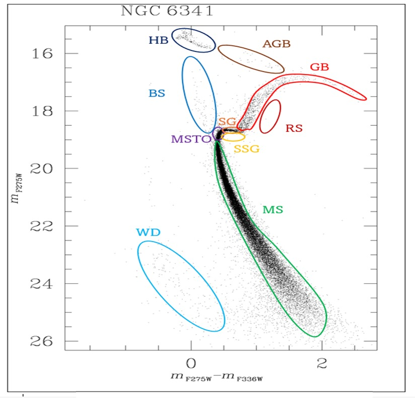
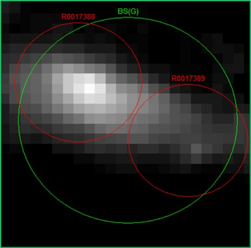
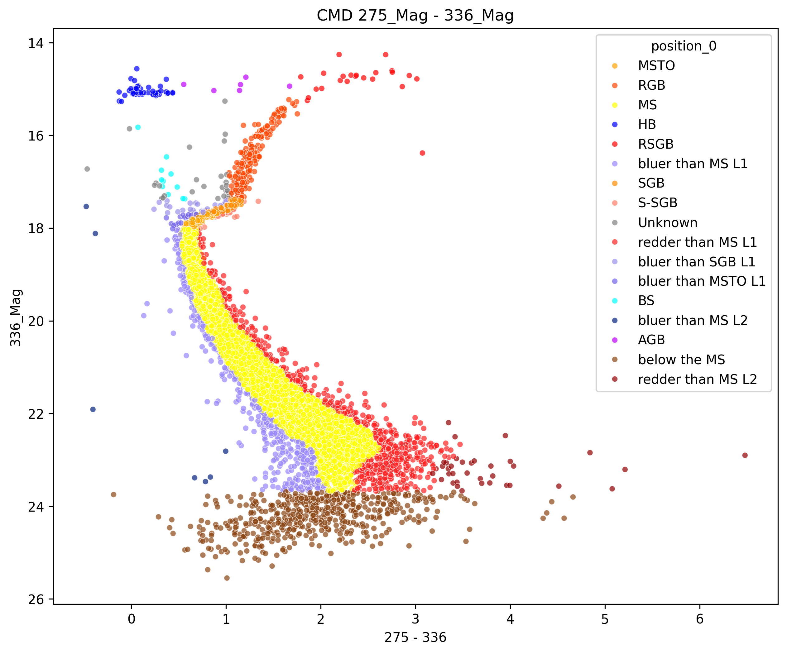
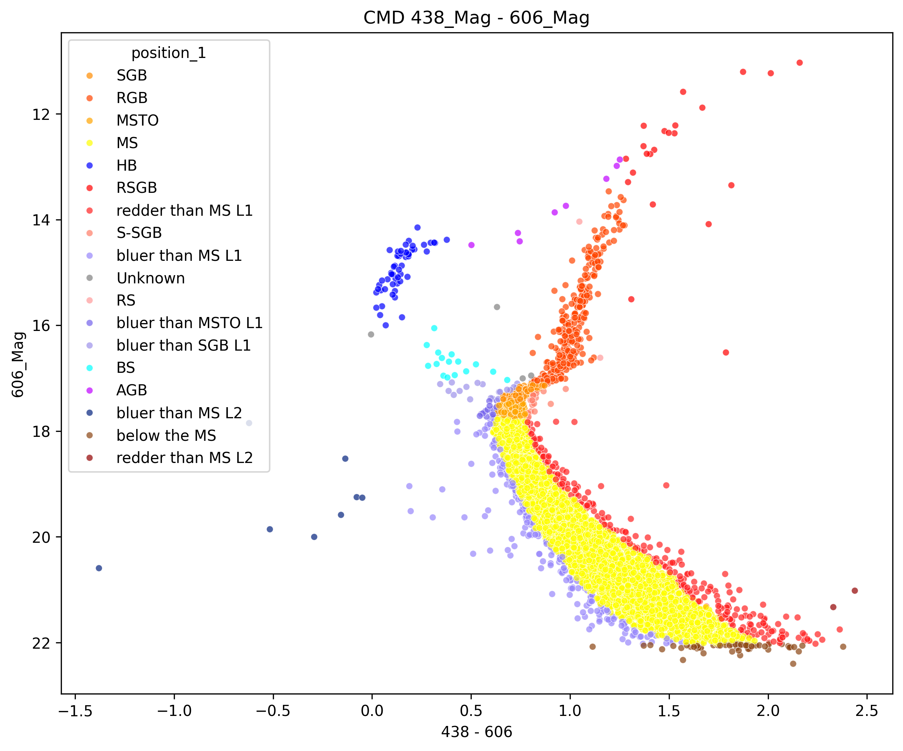
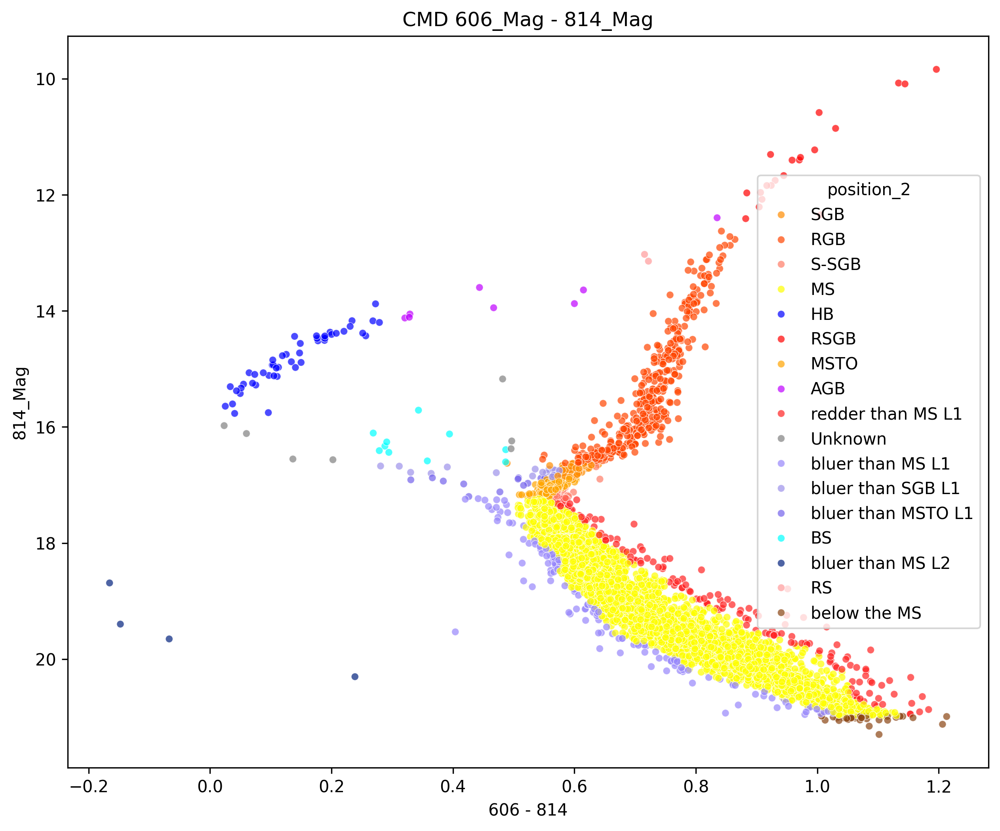
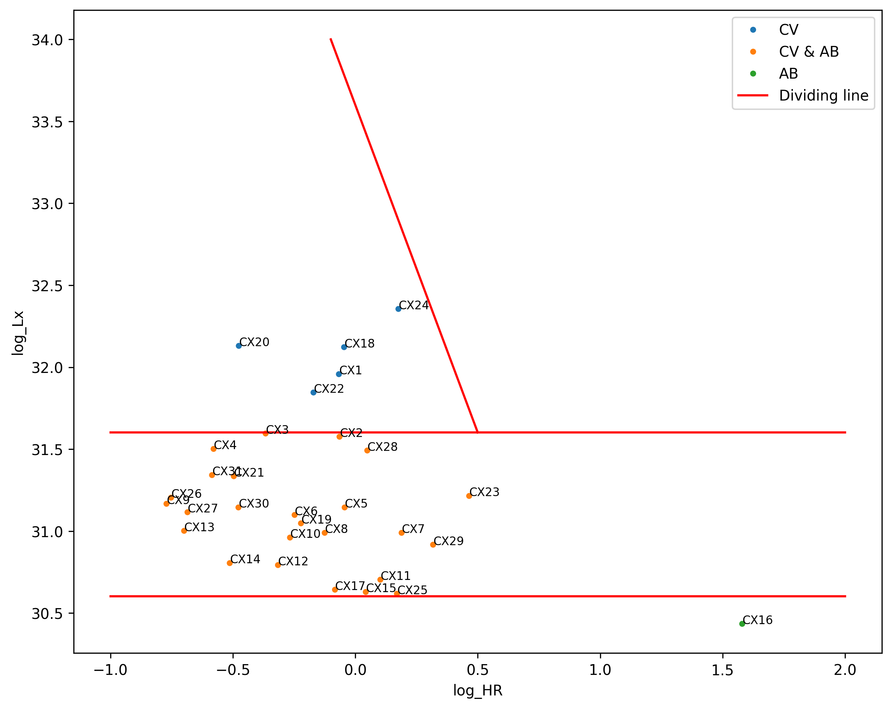
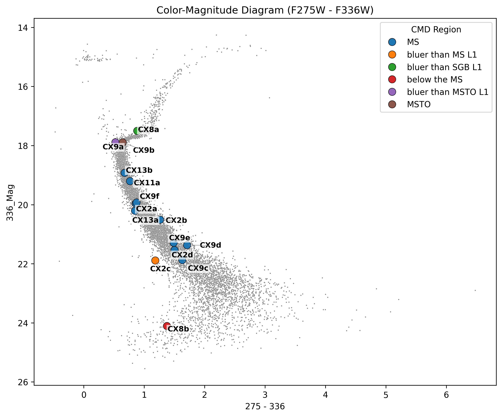
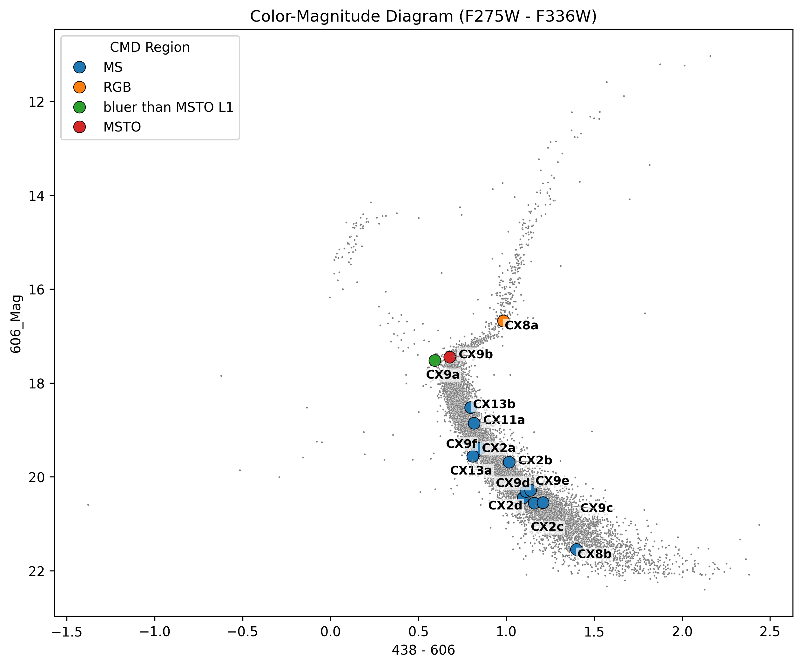
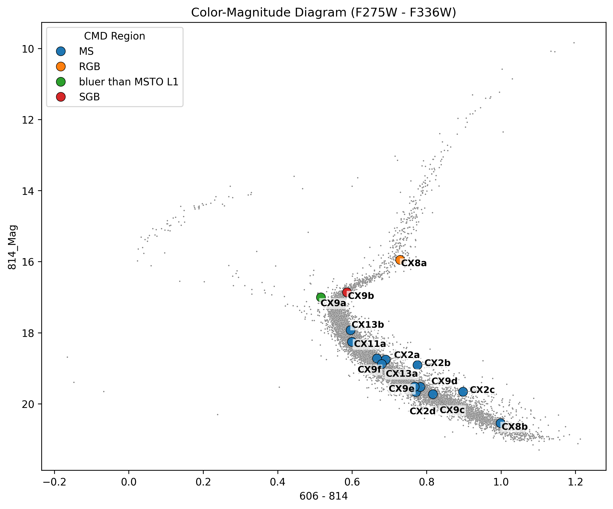

# Identification of Optical Counterparts in Globular Clusters

A Python pipeline for identifying optical counterparts of X-ray sources in globular clusters using Color–Magnitude Diagram (CMD) analysis, X-ray classification, and probabilistic cross-matching.

---

## 1) Overview

This project implements a complete data analysis pipeline that combines optical and X-ray observations to classify stellar populations and identify probable optical counterparts of X-ray sources in globular clusters.

The pipeline consists of the following main stages:

* Optical data preprocessing and filtering
* X-ray source analysis
* Cross-matching between optical and X-ray catalogs
* Finding most probable counterparts for x-ray sources

---

## 2) Background
Globular clusters are dense stellar systems where frequent interactions lead to the formation of close binary systems, many of which emit X-rays due to accretion processes. Identifying their optical counterparts—the visible sources associated with these X-ray detections—is essential to study their physical nature.

Astronomers use several criteria to identify these counterparts, including their position in Color–Magnitude Diagrams (CMDs), X-ray spectral properties (e.g., hardness), and the relationship between absolute magnitude (Mv) and X-ray luminosity. These methods allow sources to be classified into populations such as LMXRBs, CVs, and ABs, among others.

Since this analysis is repetitive across different clusters, this project automates the process by integrating these criteria into a unified pipeline, enabling efficient identification of the most probable optical counterparts.

---

## 3) Installation

### 3.1) Requirements
- Python 3.10 or 3.11 (recommended: 3.11)

### 3.2) Clone the repository

```bash
git clone <your-repo-url>
cd <your-repo-folder>
```
### 3.3) Create a virtual environment
```bash
py -3.11 -m venv test_env
```

### 3.4) Activate environment (Windows)
```bash
test_env\Scripts\activate
```
### 3.5) Install dependencies
```bash
pip install -r requirements.txt```

###  3.6) Dependencies
* pandas
* numpy
* matplotlib
* seaborn
* scikit-learn
* scipy

> Note: On Windows, avoid using paths with special characters (e.g., accents) when installing dependencies.

---

## 4) Usage

Run the full pipeline:

```bash
python -m src.main
```
You can also change the parameters of the **run_full_pipeline** function:
```bash
run_full_pipeline("NGC_6809", 
							show_optical_plots=True, 
							show_xray_plot=True, 
							show_crossmatch_DaraFrame=True, 
							show_probability_plots=True,
              search_secure_counterparts = False)
```
You can:

- Change the cluster to analyze (make sure the data is correctly uploaded)
- Enable/disable:
- Optical classification plots
- X-ray classification plots
- Show Cross-match DataFrame (possible counterparts)
- Show Probabilities for every counterpart
- Search on a big radius to find secure counterparts

The generated images will be stored inside `results/{cluster_name}/`

---
## 5) Project Structure
The project is organized as follows:

```
project/
│
├── src/
│   ├── optical_pipeline/
│   ├── xray_pipeline/
│   ├── find_candidates_pipeline/
│   ├── probability_pipeline/
│   ├── full_pipeline.py
│   ├── load_cluster_data.py
│   ├── main.py
│   └── models.py
│
├── notebooks/
│   ├── 1_classify_optical.ipynb
│   ├── 2_classify_xray.ipynb
│   ├── 3_find_counterpart_candidates.ipynb
│   └── 4_candidate_probability.ipynb
│
├── data/
│   ├── NGC_6809/
│   │   ├── config.json
│   │   ├── optical_sources.txt
│   │   └── xray_sources.txt
│   └── images/
│
├── results/
│   └── NGC_6809/
│       ├── optical_plots/
│       └── xray_plots/
│
├── .gitignore
├── requirements.txt
├── README.md
├── LICENSE
```

---

## 6)  Custom data
By default, the project analyzes the cluster `NGC_6809`, but you can use any cluster by adding your own data.
### 6.1) Create the folder
Inside `data/`, create a folder with your cluster name:
```bash
data/{your_cluster_name}/
```
### 6.2) Optical data 
Download optical data (e.g., from the [HST UV Globular Cluster Survey ("HUGS")](https://archive.stsci.edu/prepds/hugs/)
- Copy only the data (exclude column descriptions)
- Save it as a `.txt` file (recommended: `optical_sources.txt`)
- Place it inside your cluster folder

You can use other sources, but column formats must match the expected structure.
### 6.3) X-ray data 
Obtain X-ray data (e.g., from papers or the Chandra Observatory).
Required fields:
- RA, Decl (sexagesimal)
- Counts: Xsoft, Xmed, Xhard (detected/corrected)
- Flux: Fx_0.5-2.5, Fx_2.5-6.0 

Store the data as a dictionary in a `.txt` file (recommended: `xray_sources.txt`) inside your cluster folder.
### 6.4) Configuration file
Create a `config.json` file:
```bash
{
  "BS_RA": -0.0000271, 							# Boresight of the RA
  "BS_Decl": -0.0000481,						# Boresight of the Decl
  "distance_parsecs": 5400,					   # Distance of the cluster
  "xray_file": "xray_sources.txt",				# Name of the file of Xray sources
  "optical_file": "optical_sources.txt"		  # Name of the file of Optical sources
  }
```
Final structure
```bash
data/
    {your_cluster_name}/
        config.json
        optical_sources.txt
        xray_sources.txt
```
---
## 7) Key Concepts

### 7.1) CMD Classification
A Color-Magnitude Diagram (CMD) is used to identify stellar populations and potential X-ray counterparts.

X-ray sources are typically found in regions offset from the Main Sequence (redder or bluer), including:
- Red Stragglers  
- Blue Stragglers  
- Giant Branch  



---

### 7.2) Main Sequence Identification
The Main Sequence is the most populated region in a CMD and serves as a reference to identify other stellar populations.

This project detects it automatically by locating the densest region of the CMD.

---

### 7.3) Cluster Visualization
Some sources (e.g., background galaxies or AGNs) are not identified by the pipeline since they do not belong to the cluster.

They can be detected by visualizing `.fits` images (e.g., using SAOImage DS9) and inspecting X-ray confidence regions.

<p align="center">
  <br>
  <em>Galaxy inside a globular cluster field (example of non-cluster X-ray source)</em>
</p>
---

### 7.4) Boresight Correction

#### What is it?
The boresight is the positional offset between:
- Optical data (Hubble)
- X-ray data (Chandra)

This correction must be applied to align both datasets, this is done by finding a secure counterpart for a X-ray source.

#### How to compute it

Boresight_RA = Secure_optical_counterpart_RA - Xray_RA
Boresight_Decl = Secure_optical_counterpart_Decl - Xray_Decl

#### How to find a secure counterpart

You need one reliable match between optical and X-ray data:

- **From literature (recommended):**
  - Use published counterparts with high confidence.
  - Find the secure optical source in your optical Data (Using visualization software like SaoDS9)
  - Obtain the right ascension (RA) and declination (Decl) of that optical source to calculate the boresight.
 
 **From your data:**
  - Run the pipeline with a larger search radius (2 arcsec), this can be done by changing the parameter **search_secure_counterpart** to True.
  - Identify candidates with probability > 75%.
  - Use one as a secure counterpart.
  - Once obtained, apply the boresight correction to all X-ray sources.
---
## 8)  Output

After running the pipeline, the results are saved in the `results/{cluster_name}/` directory.

### Generated Outputs

- **Optical CMD plots**
  - Located in `results/{cluster_name}/optical_plots/`
  - Show stellar populations and highlight possible optical counterparts
  - Sources are labeled and colored according to their CMD region

<p align="center">
  
  
  
</p>

- **X-ray classification plots**
  - Located in `results/{cluster_name}/xray_plots/`
  - Display the classification of X-ray sources based on their properties

<p align="center">
  
</p>

- **Candidate counterparts**
  - Located in `results/{cluster_name}/candidates/`
  - Show CMD with all candidates to be an optical counterpart.
  - Each candidate is colored according to its CMD region and labeled with its ID.

<p align="center">
  
  
  
</p>

---
## 9) Key Results

- Identified candidate optical counterparts for X-ray sources in NGC 6809
- Classified sources based on CMD regions and X-ray properties
- Generated reproducible visual and tabular outputs for further analysis

## 10) Future Work


- Improve CMD classification to handle irregular or non-standard cluster distributions.
- Integrate machine learning models for automated classification.
- Develop a web interface (e.g., using Streamlit) for easier interaction.
- Make data input more flexible (reduce strict formatting requirements).
- Incorporate additional criteria such as Hα emission and source morphology.

---

## 11) Next Milestone

Develop an automated classification module using machine learning to identify X-ray source types from optical and X-ray features.

- Build a labeled dataset from known classified sources  
- Engineer features (colors, magnitudes, flux ratios, spatial offsets)  
- Train and evaluate models (e.g., Random Forest, XGBoost)  
- Integrate the model into the existing pipeline  
- Compare performance against current rule-based classification --

## 12) Author

**Angel Montes Palma**  
*Bachelor of Science in Physics*

---

## 13) Project Notes

> **Core Objective:** This project is intended for **scientific and educational purposes**, specifically tailored for:
> *   **Astrophysical Data Analysis:** Processing raw astronomical observations.
> *   **Source Classification:** Implementing robust workflows for object identification.

## 14) References

This project is based on methods and data from the following works:

**[1]** Nardiello, D., et al. (2018). *The Hubble Space Telescope UV Globular Cluster Survey (HUGS)*. Mikulski Archive for Space Telescopes (MAST). [Online]. Available: [https://archive.stsci.edu/prepds/hugs/](https://archive.stsci.edu/prepds/hugs/)

**[2]** Lu, T.-N., Kong, A. K. H., Verbunt, F., Lewin, W. H. G., Anderson, S. F., & Pooley, D. (2011). Chandra and HST Studies of the X-ray Sources in Galactic Globular Cluster M92. *The Astrophysical Journal*, 736(2), 158. doi:[10.1088/0004-637x/736/2/158](https://doi.org/10.1088/0004-637x/736/2/158)

**[3]** Stacey, W. S., Heinke, C. O., Cohn, H. N., Lugger, P. M., & Bahramian, A. (2012). An Examination of the X-ray Sources in the Globular Cluster NGC 6652. *The Astrophysical Journal*, 751(1), 62. doi:[10.1088/0004-637x/751/1/62](https://doi.org/10.1088/0004-637x/751/1/62)

**[4]** Coomber, G., Heinke, C. O., Cohn, H. N., Lugger, P. M., & Grindlay, J. E. (2011). The Unusual X-ray Binaries of the Globular Cluster NGC 6652. *The Astrophysical Journal*, 735(2), 95. doi:[10.1088/0004-637x/735/2/95](https://doi.org/10.1088/0004-637x/735/2/95)

**[5]** Kumawat, G., Heinke, C. O., Cohn, H. N., & Lugger, P. M. (2024). Chandra and HST studies of the X-ray sources in the Globular Cluster NGC 362. *Monthly Notices of the Royal Astronomical Society*. doi:[10.1093/mnras/stae865](https://doi.org/10.1093/mnras/stae865)

**[6]** Bassa, C. G., Pooley, D., Verbunt, F., Homer, L., Anderson, S. F., & Lewin, W. H. G. (2008). X-ray and optical observations of M55 and NGC 6366: Evidence for primordial binaries. *Astronomy & Astrophysics*, 488(3), 921–933. doi:[10.1051/0004-6361:200809350](https://doi.org/10.1051/0004-6361:200809350)

**[7]** Bassa, C. G., et al. (2004). X-Ray Sources and Their Optical Counterparts in the Globular Cluster M4. *The Astrophysical Journal*, 609(2), 755–765. doi:[10.1086/421259](https://doi.org/10.1086/421259)

**[8]** Huang, R. H. H., Becker, W., Edmonds, P. D., Elsner, R. F., Heinke, C. O., & Hsieh, B. C. (2010). Study of Hubble Space Telescope counterparts to Chandra X-ray sources in the globular cluster M71. *Astronomy & Astrophysics*, 513, A16. doi:[10.1051/0004-6361/200811245](https://doi.org/10.1051/0004-6361/200811245)

**[9]** Verbunt, F., Pooley, D., & Bassa, C. (2007). Observational Evidence for the Origin of X-ray Sources in Globular Clusters. *Proceedings of the International Astronomical Union*, 3(S246), 301–310. doi:[10.1017/s1743921308015822](https://doi.org/10.1017/s1743921308015822)

**[10]** Heinke, C. O., Kologera, V., & van der Sluys, M. (2010). X-ray Sources in Galactic Globular Clusters. *AIP Conference Proceedings: Binaries - A Celebration of Ron Webbink's 65th Birthday*. doi:[10.1063/1.3536355](https://doi.org/10.1063/1.3536355)

**[11]** Schuster, W. (2025). *Identification of Candidate Ultraviolet Counterparts to Globular Cluster X-ray Binaries*. College of Science and Health Theses and Dissertations, 613. [Online]. Available: [https://via.library.depaul.edu/csh_etd/613](https://via.library.depaul.edu/csh_etd/613)